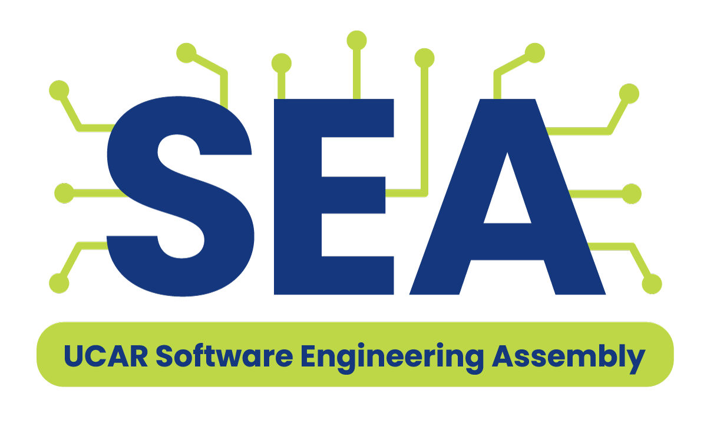

# SEA-ISS 2025 Notebook Submission Template 📓

This repository contains a template for submitting your paper to the [2025 Software Engineering Assembly Conference](https://sea.ucar.edu/iss/2025/).

## How to Use This Template 🛠️

⚠️ Please see the [how to use this template](https://ucar-sea.github.io/SEA-ISS-Template/submission-guidelines.html) page for detailed instructions on how to use this template to submit your paper to the conference.

For your submissions, please remove everything above this line and fill in the details of your paper here:

-------------------
Remove anything above this line and fill in the details of your paper below:

# Paper Title [Add Your Title Here]

**Authors**: [List of Authors]

**Abstract**: [Your Abstract Here]

**Keywords:** [Use keywords that describe the content of your paper, comma separated]

**Acknowledgements**: [List any Acknowledgements]

---

*Note: Replace the placeholders above with the specific details of your paper.*
  

