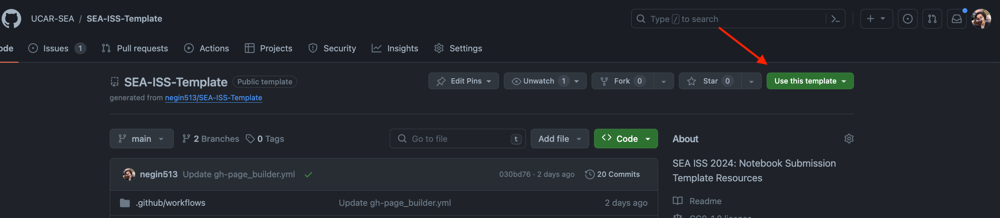

# How to Use This Template 🛠️

**Estimated submission time: 30 minutes**
## Create your Paper Repository

1. **Create a New Repository Using this Template**: Click on the "Use this template" button to create a new repository with the files from this template. 


2. **Environment Setup**: Update the `requirements.txt` file and add any additional packages you may require. 

3. **Paper Information**: Fill in the details of your paper in this `README.md`, including the title, authors, abstract, and other relevant acknowledgements.

4. **Add your Paper**: Add your paper as a Jupyter Notebook in the `notebooks` folder. You can use multiple notebooks or one notebook if you wish. You can also use markdown files if you prefer.

```
notebooks/
|── introduction.md
├── notebook1.ipynb
└── notebook2.ipynb
```
5. **Update the Table of Contents**: Update the `toc.yml` file to include the notebooks you've added.
 
6. **Remove Instructions**: Once you've set up your repository, delete these instructions. 

7. **Commit your changes**: Commit and push your changes to your repository.

8. **Check your Jupyter Book**: Once you've pushed your changes, check that your Jupyter Book is building correctly. You can check the status of your Jupyter Book by clicking on the "Actions" tab of your repository.

## Ready to Submit your Paper? 📝

9. **Submit your Paper:** Once you've completed the steps above, you can submit your paper to the conference organizers:
* Once you are ready to submit your paper, go to the "Issues" tab of this repository and [click "New Issue"](https://github.com/UCAR-SEA/SEA-ISS-Template/issues/new).
* Someone from the SEA committee will add your github username to the list of collaborators for the UCAR-SEA github organization.
* Once you accepted the invitation, you can transfer your repository to the UCAR-SEA organization.
* Navigate to the settings of your paper repository, scroll down to the Danger Zone, and click "Transfer" . 
* Select or type "UCAR-SEA" to transfer the repository to the conference organizers. This step will make your paper public and allow the conference organizers to review your paper.


## Make Zenodo DOI for your paper

10. **Make Zenodo DOI for your paper:** Once you've completed the steps above, you can make Zenodo DOI for your paper:

* Go to [Zenodo](https://zenodo.org/) and login with your GitHub account.
* Click on "New Upload" and select your paper repository.
* You need to first create a new release for your paper repository. Click on "Create a new release" and add the version number of your paper. For example, if this is the first version of your paper, you can add "v1.0.0" as the version number.
* Once you've created a new release, you can go back to the "New Upload" page and select the version of your paper and create a new DOI for your paper.

-----------------
You can submit your paper as one notebook or split it up to multiple notebooks and markdown files. Please see the [example paper1](notebooks/notebook-template) and [example paper2](notebooks/notebook-example2_part1) for examples of how to structure your paper.


For your submissions, please use the following naming convention for your paper repository: `SEA-ISS-2024-<paper-title>`. For example, if your paper title is "My Awesome Paper", your repository name should be `SEA-ISS-2024-My-Awesome-Paper`.


